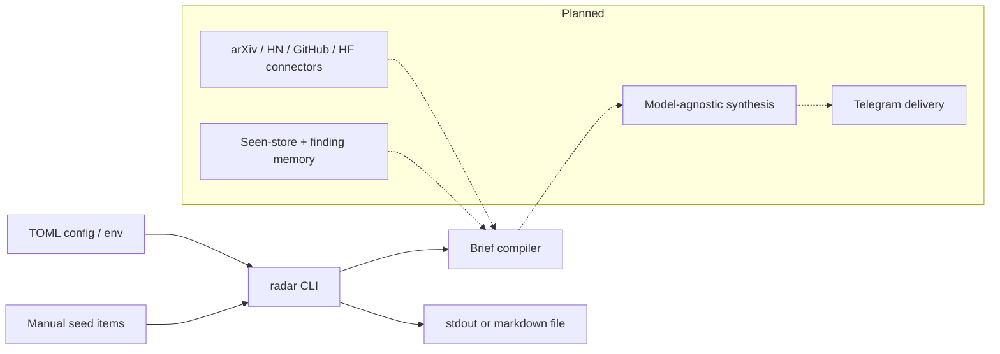

# AI Research Radar

AI Research Radar is a self-hostable CLI foundation for turning selected AI
research items into a concise daily brief. The first version focuses on the
package boundary, config model, and `radar` command surface needed before source
connectors, memory, LLM synthesis, and Telegram delivery are added.

The current MVP is intentionally offline and deterministic. It reads seed items
from a TOML config file or the CLI, ranks them against configured watch terms,
and emits a markdown brief to stdout or a file.

## Why

AI research discovery is noisy across arXiv, Hacker News, GitHub, Hugging Face,
and private notes. A raw feed adds more work; a useful radar needs to remember
what has already been seen, connect related work, and deliver a short brief
where the operator already works.

This repository starts with the smallest production-shaped slice: a typed Python
package, a stable CLI, config via file or environment, and tests around the
briefing behavior. That gives the product a reliable core before network
connectors and delivery adapters expand the system.

## Architecture



The system boundary is currently simple:

| Layer | Current role | Planned extension |
| --- | --- | --- |
| CLI | Runs `once` or `run`, loads config, accepts manual seed items | Scheduling helper and Telegram control commands |
| Config | TOML file plus `RADAR_*` environment overrides | Connector credentials and delivery settings |
| Brief compiler | Deterministic scoring and markdown rendering | LLM synthesis over multiple source families |
| Output | stdout or markdown file | Telegram delivery and managed hosting adapters |

## Quickstart

```bash
python -m venv .venv
source .venv/bin/activate
python -m pip install -e .
radar once --item "Memory agents|https://example.com/memory-agents|manual|Relevant to durable agent state"
```

Example config lives at `examples/radar.toml`:

```toml
title = "AI Research Radar"
topic = "agentic AI systems"
watch_terms = ["agents", "memory", "evaluation", "MLOps"]
output_path = "briefs/today.md"
interval_seconds = 86400
max_items = 5

[[items]]
title = "Memory agents"
url = "https://example.com/memory-agents"
source = "manual"
note = "Useful framing for durable agent state and conflict handling."
```

Run once with a config file:

```bash
radar once --config examples/radar.toml
```

Run repeatedly:

```bash
radar run --config examples/radar.toml
```

For CI or smoke tests, cap the loop:

```bash
radar run --config examples/radar.toml --limit 1
```

## Current Scope

This version does not fetch from arXiv, Hacker News, GitHub, Hugging Face, call
an LLM, persist seen items, or send Telegram messages yet. It establishes the
package shape and command contract those pieces will use.

## Roadmap

| Milestone | Scope |
| --- | --- |
| r1 | Standalone package, typed source layout, `radar once`, `radar run`, config via env/file, tests, CI |
| r2 | Pluggable source connectors for arXiv, Hacker News, GitHub, and Hugging Face |
| r3 | File-backed seen-store and persisted findings to avoid repeated briefs |
| r4 | Model-agnostic synthesis backend for structured brief generation |
| r5 | Telegram delivery and locked-down two-way control commands |
| r6 | Scheduling presets for systemd and cron |
| r7 | Examples, screenshots, and clear separation between free core and Pro extras |

## Development

```bash
python -m pip install -e .
python -m pytest -q
```

The package targets Python 3.11+ and uses only the standard library for the first
milestone.
