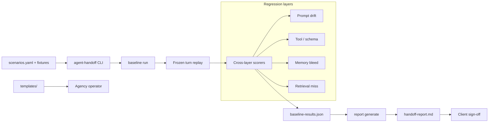

# Agent Handoff Kit

[](https://github.com/mastroke/agent-handoff-kit/actions/workflows/ci.yml)
[](https://www.python.org/downloads/)
[](LICENSE)

Deterministic baseline replay and client sign-off reporting for AI agent handoffs.
Replay frozen multi-turn scenarios, score four regression layers, and generate a
Markdown acceptance report — no API keys, no live model calls.

Built by [Masoob (@mastroke)](https://github.com/mastroke).

## OSS CLI vs paid Agency Handoff Pack

| | **OSS (this repo)** | **Agency Handoff Pack ($49)** |
| --- | --- | --- |
| CLI baseline runner | Yes | Yes |
| Sign-off report generator | Yes | Branded template |
| Sample scenarios | 3 support-agent flows | 12+ curated scenarios |
| Contract templates | Basic SOW + procurement one-pager | Agency-ready pack |
| Live LLM replay | No | No |

The CLI is MIT-licensed and fully usable without the paid pack. The pack is for
agencies that want extended scenarios and delivery templates, not a separate runtime.

See [`docs/gumroad-listing.md`](docs/gumroad-listing.md) for paid-pack positioning copy.

## Quick start

```bash
pip install -e ".[dev]"

agent-handoff baseline run --config scenarios/support-agent/scenarios.yaml
agent-handoff report generate --client-name "Acme Corp"
```

Exit code `0` = all scenarios pass. Non-zero = blocked until regressions are fixed
or explicitly waived.

Results default to `.handoff/baseline-results.json`; reports to
`.handoff/handoff-report.md`.

## What it checks

Each scenario in `scenarios.yaml` defines frozen multi-turn turns plus four
optional regression layers:

1. **Prompt drift** — required/forbidden fragments and optional baseline prompt file
2. **Tool call / schema** — allowed tools, required calls, JSON required-arg schema
3. **Memory bleed** — forbidden cross-session substrings in constructed context
4. **Retrieval miss** — required knowledge sources present in frozen retrieval set

Pass/fail is deterministic: same fixtures, same result, every run.

## Architecture



## Repository layout

```
agent-handoff-kit/
├── src/agent_handoff/     # CLI, baseline runner, report generator
├── scenarios/             # Sample frozen scenarios (support agent)
├── templates/             # Agency SOW snippet + procurement one-pager
├── docs/                  # Gumroad listing copy
└── tests/                 # pytest suite
```

## Honest scope

**In scope**

- Offline replay of frozen agent transcripts
- Deterministic pass/fail per regression layer
- Client-ready Markdown sign-off reports
- Editable YAML scenarios you own

**Out of scope**

- Invoking live LLMs, tools, or vector databases
- Embedding similarity or reranker quality scoring
- Production observability, load testing, or security audits
- Proving formal session isolation (checks are heuristic)

We document these limits in every generated report's **Known limitations** section.

## Scenario format (excerpt)

```yaml
scenarios:
  - id: billing-duplicate-charge
    system_prompt: |
      You are Acme SaaS support...
    turns:
      - role: user
        content: "I was charged twice..."
      - role: assistant
        tool_calls:
          - name: lookup_billing
            arguments: { email: "user@example.com" }
    checks:
      prompt_drift:
        required_fragments: [support, billing policy]
      tool_schema:
        allowed_tools: [lookup_billing, create_refund]
        schema_file: schemas/tools.json
      memory_bleed:
        forbidden_in_context: ["previous ticket #8891"]
      retrieval:
        required_sources: [refund-policy.md]
        retrieved_sources: [refund-policy.md, billing-faq.md]
```

See [`scenarios/support-agent/scenarios.yaml`](scenarios/support-agent/scenarios.yaml)
for a complete example.

## Development

```bash
pip install -e ".[dev]"
python -m pytest -q
```

CI runs the full test suite and a smoke baseline on every push and pull request.

## Templates

- [`templates/agency-sow-snippet.md`](templates/agency-sow-snippet.md) — paste into agency SOWs
- [`templates/procurement-one-pager.md`](templates/procurement-one-pager.md) — client procurement summary

## License

MIT — see [LICENSE](LICENSE).
