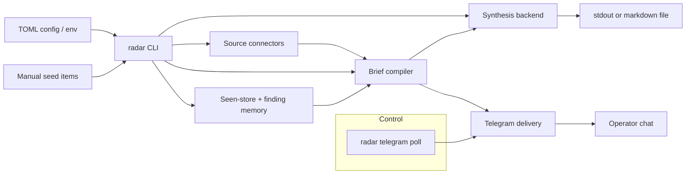
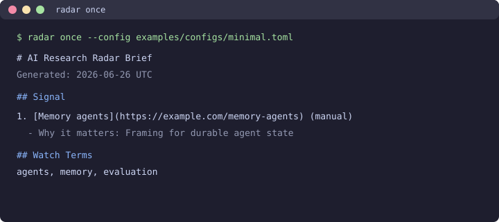
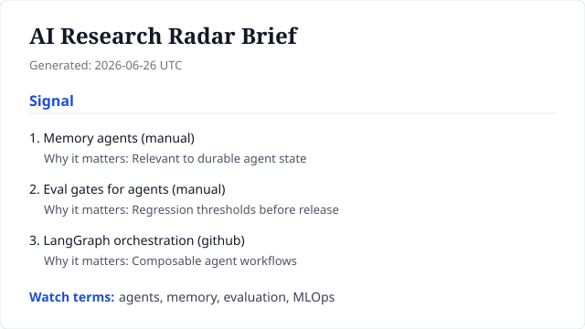
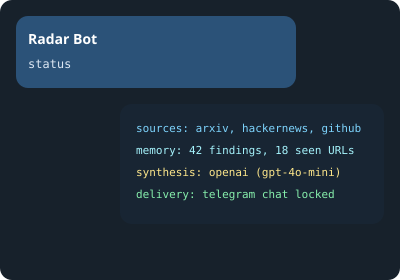

# AI Research Radar

AI Research Radar is a self-hostable CLI foundation for turning selected AI
research items into a concise daily brief. The first version focuses on the
package boundary, config model, and `radar` command surface for source
connectors, memory, LLM synthesis, and Telegram delivery.

The current MVP is intentionally offline and deterministic. It reads seed items
from a TOML config file or the CLI, ranks them against configured watch terms,
and emits a markdown brief to stdout or a file.

## Why

AI research discovery is noisy across arXiv, Hacker News, GitHub, Hugging Face,
and private notes. A raw feed adds more work; a useful radar needs to remember
what has already been seen, connect related work, and deliver a short brief
where the operator already works.

This repository starts with the smallest production-shaped slice: a typed Python
package, a stable CLI, config via file or environment, and tests around the
briefing behavior. That gives the product a reliable core before network
connectors and delivery adapters expand the system.

## Architecture



The system boundary is currently simple:

| Layer | Current role | Planned extension |
| --- | --- | --- |
| CLI | Runs `once`, `run`, `schedule`, or `telegram poll`; loads config, accepts manual seed items | Additional delivery adapters |
| Config | TOML file plus `RADAR_*` environment overrides | Connector credentials and delivery settings |
| Connectors | arXiv, Hacker News, GitHub, and Hugging Face (best-effort, timeout-bound) | Additional sources and credential-aware rate limits |
| Brief compiler | Deterministic scoring and markdown rendering | Cross-source ranking input for synthesis |
| Synthesis | Optional OpenAI, Anthropic, or Azure backends with BYOK | Provider failover chains and prompt packs |
| Memory | File-backed seen-store and persisted findings | Graph links and conflict resolution |
| Output | stdout, markdown file, or Telegram when configured | Managed hosting adapters |

## Quickstart

```bash
python -m venv .venv
source .venv/bin/activate
python -m pip install -e .
radar once --config examples/configs/minimal.toml
```

### Screenshots

Terminal output from a minimal config run:



Rendered brief shape (deterministic compiler):



Telegram `status` response when delivery and control are configured:



### Example configs

| Profile | Path | Use case |
| --- | --- | --- |
| Minimal | [`examples/configs/minimal.toml`](examples/configs/minimal.toml) | Manual seed items, offline deterministic brief |
| Connectors | [`examples/configs/connectors.toml`](examples/configs/connectors.toml) | Live arXiv/HN/GitHub/HF fetch with memory |
| Full stack | [`examples/radar.toml`](examples/radar.toml) | Schedule block plus optional synthesis and Telegram |

```bash
# Offline smoke test (no network)
radar once --config examples/configs/minimal.toml

# Live connectors with memory dedup
radar once --config examples/configs/connectors.toml

# One-off CLI item
radar once --item "Memory agents|https://example.com/memory-agents|manual|Relevant to durable agent state"
```

### Example briefs

Static samples checked into the repo (not generated at runtime):

- [`examples/briefs/deterministic-sample.md`](examples/briefs/deterministic-sample.md) — ranked manual and seed items
- [`examples/briefs/multi-source-sample.md`](examples/briefs/multi-source-sample.md) — cross-source connector shape

Full config reference: [docs/config.md](docs/config.md).

Example `examples/radar.toml`:

```toml
title = "AI Research Radar"
topic = "agentic AI systems"
watch_terms = ["agents", "memory", "evaluation", "MLOps"]
output_path = "briefs/today.md"
interval_seconds = 86400
max_items = 5
sources = ["arxiv", "hackernews", "github", "huggingface"]
connector_timeout_seconds = 10

[[items]]
title = "Memory agents"
url = "https://example.com/memory-agents"
source = "manual"
note = "Useful framing for durable agent state and conflict handling."
```

Run once with a config file:

```bash
radar once --config examples/radar.toml
```

Run repeatedly:

```bash
radar run --config examples/radar.toml
```

For CI or smoke tests, cap the loop:

```bash
radar run --config examples/radar.toml --limit 1
```

## Free core vs Radar Pro

The MIT repository is the **free core**: CLI, connectors, memory, optional BYOK
synthesis, Telegram delivery, and scheduling helpers. No license key is required.

**Radar Pro** (Gumroad kit under [`packaging/pro-kit/`](packaging/pro-kit/)) sells
operational time-savers, not gated runtime features:

| Free core (GitHub) | Radar Pro kit |
| --- | --- |
| Full `radar` CLI and tests | Persona configs (builder, researcher, investor) |
| Example configs in `examples/` | Curated synthesis prompt packs |
| Basic scheduling examples | Production systemd/cron templates with runbooks |
| ADRs and config reference | Telegram and host deployment guides |

See [`packaging/pro-kit/MANIFEST.md`](packaging/pro-kit/MANIFEST.md) for the
full boundary. Build a release archive:

```bash
./packaging/pro-kit/build-archive.sh
```

Design record: [docs/adr-0007-open-core-packaging.md](docs/adr-0007-open-core-packaging.md).

## Current Scope

Configured `sources` fetch live items from arXiv, Hacker News, GitHub, and
Hugging Face with per-request timeouts. Failed connectors are skipped without
aborting the brief. Optional `GITHUB_TOKEN` improves GitHub rate limits.

When `[synthesis]` is configured with a supported provider and matching API key
environment variables, the CLI compiles cross-source briefs through the model
backend when findings span at least two source families. Missing credentials,
single-source runs, and provider errors fall back to the deterministic markdown
compiler.

Manual seed items and connector findings are merged before ranking. When
`memory_path` is set, findings persist across runs and URLs already included in
a brief are skipped on later runs.

Synthesis provider environment variables:

| Provider | Required variables |
| --- | --- |
| `openai` | `RADAR_OPENAI_API_KEY` |
| `anthropic` | `RADAR_ANTHROPIC_API_KEY` |
| `azure` | `RADAR_AZURE_OPENAI_API_KEY`, `RADAR_AZURE_OPENAI_ENDPOINT`, `RADAR_AZURE_OPENAI_DEPLOYMENT` |

### Telegram delivery

Set a bot token and lock delivery to one chat id:

```bash
export RADAR_TELEGRAM_BOT_TOKEN="..."
export RADAR_TELEGRAM_CHAT_ID="123456789"
```

Or configure in TOML (token still comes from the environment):

```toml
[telegram]
chat_id = 123456789
timeout_seconds = 30
```

`radar once` and `radar run` send the compiled brief to that chat after the
usual stdout or file write. Listen for operator commands in a separate process:

```bash
radar telegram poll --config examples/radar.toml
```

Commands are accepted only from the configured chat id:

- `status` — sources, memory counts, synthesis mode
- `find <url>` — focused brief for one URL (uses persisted memory when present)

## Scheduling

Production hosts should run `radar once` on a timer instead of keeping
`radar run` in a shell. The `schedule` helper renders cron or systemd artifacts
from your config file:

```bash
radar schedule --config examples/radar.toml --format cron
radar schedule --config examples/radar.toml --format systemd --output-dir ./systemd
```

Optional `[schedule]` settings in TOML:

```toml
[schedule]
preset = "daily"   # daily | interval
at = "08:00"       # local HH:MM for the daily preset
```

The `interval` preset uses root `interval_seconds` and is best paired with
systemd when the period is not hour-aligned. Add `--with-telegram-poll` to emit a
long-running unit for `radar telegram poll`.

Static examples live under `examples/scheduling/`. Full config keys are listed
in [docs/config.md](docs/config.md).

## Roadmap

| Milestone | Scope |
| --- | --- |
| r1 | Standalone package, typed source layout, `radar once`, `radar run`, config via env/file, tests, CI |
| r2 | Pluggable source connectors for arXiv, Hacker News, GitHub, and Hugging Face |
| r3 | File-backed seen-store and persisted findings to avoid repeated briefs |
| r4 | Model-agnostic synthesis backend for structured brief generation |
| r5 | Telegram delivery and locked-down two-way control commands |
| r6 | Scheduling presets for systemd and cron |
| r7 | Examples, screenshots, and clear separation between free core and Pro extras (done) |

## Development

```bash
python -m pip install -e .
python -m pytest -q
```

The package targets Python 3.11+ and uses only the standard library for the first
milestone.
