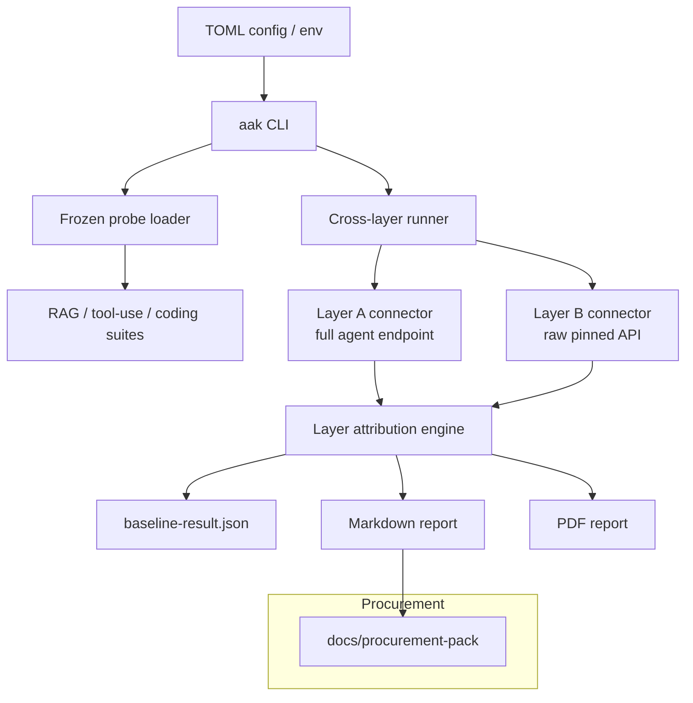

# Agent Acceptance Kit

[](https://github.com/mastroke/agent-acceptance-kit/actions/workflows/ci.yml)
[](https://www.python.org/downloads/)
[](LICENSE)

Python CLI for **cross-layer agent acceptance baselines**: run the same frozen
probe set against **Layer A** (full agent endpoint) and **Layer B** (raw pinned
API), then emit a **layer attribution verdict** plus markdown/PDF acceptance
reports suitable for engineering procurement.

Conceptually aligned with the frozen-harness cross-layer methodology from
[mastroke/agent-loop-hillclimber](https://github.com/mastroke/agent-loop-hillclimber);
this repository is **standalone** and ships its own probe suites and report
generators.

## Why cross-layer baselines?

Evaluating an agent product on end-to-end demos alone makes it hard to tell
whether quality comes from the model, retrieval, tools, or orchestration bugs.
Running identical probes on both the deployed agent stack and a pinned raw API
surfaces **agent value-add** (A passes, B fails) versus **agent regression**
(B passes, A fails) versus **shared failure** (both fail).

## Architecture



| Component | Role |
| --- | --- |
| `aak baseline run` | Execute frozen probes on Layer A and B |
| Probe suites | Versioned YAML in `src/agent_acceptance_kit/suites/` |
| Connectors | `mock` (offline), `agent` (HTTP agent endpoint), `api` (raw API) |
| Attribution | Classify each probe: baseline met, value-add, regression, shared failure |
| Reports | Markdown (always) and PDF (optional `[pdf]` extra) |
| Procurement pack | Report template + sample clause snippets (not legal advice) |

## Quickstart

```bash
python -m venv .venv
source .venv/bin/activate
python -m pip install -e ".[dev]"

# Offline mock baseline (no network)
aak baseline run --config examples/baseline-mock.toml \
  --report-md acceptance-runs/report.md

# List starter suites
aak suites list

# Render PDF from saved JSON (optional extra)
python -m pip install -e ".[dev,pdf]"
aak report acceptance-runs/baseline-result.json --format pdf -o report.pdf
```

Example stdout verdict snippet:

```json
{
  "verdict": {
    "classification": "agent_value_add",
    "pass_rate_a": 1.0,
    "pass_rate_b": 0.33,
    "summary": "Agent layer adds measurable value on 6 probes versus raw API."
  }
}
```

## Starter probe suites

| Suite | Probes | Focus |
| --- | ---: | --- |
| `rag` | 3 | Context citation, conflict resolution |
| `tool_use` | 3 | Calendar, search, calculator tool paths |
| `coding_agent` | 3 | Patch generation, pytest awareness, safe refactor |

Extend by adding versioned YAML under `src/agent_acceptance_kit/suites/` and
listing the suite in config.

## Configuration

See [`examples/baseline-mock.toml`](examples/baseline-mock.toml). Key fields:

```toml
[layer_a]
name = "agent-endpoint"
kind = "agent"  # mock | agent | api
endpoint = "https://agent.example.com/v1/complete"
model = "agent-prod"
api_key_env = "AAK_AGENT_API_KEY"

[layer_b]
name = "raw-api"
kind = "api"
endpoint = "https://api.openai.com/v1/chat/completions"
model = "gpt-4.1-mini"
api_key_env = "AAK_RAW_API_KEY"
```

Set `AAK_CONFIG` to default a config path.

## Procurement pack

[`docs/procurement-pack/`](docs/procurement-pack/) includes:

- [`acceptance-report-template.md`](docs/procurement-pack/acceptance-report-template.md) — sign-off oriented report skeleton
- [`clause-snippets.md`](docs/procurement-pack/clause-snippets.md) — sample RFP/SOW language (**not legal advice**)

## Development

```bash
python -m pip install -e ".[dev,pdf]"
python -m pytest -q
aak --help
```

Targets Python 3.11+. Core runtime depends on PyYAML only; PDF is optional via
`fpdf2`.

## License

MIT — see [LICENSE](LICENSE).
